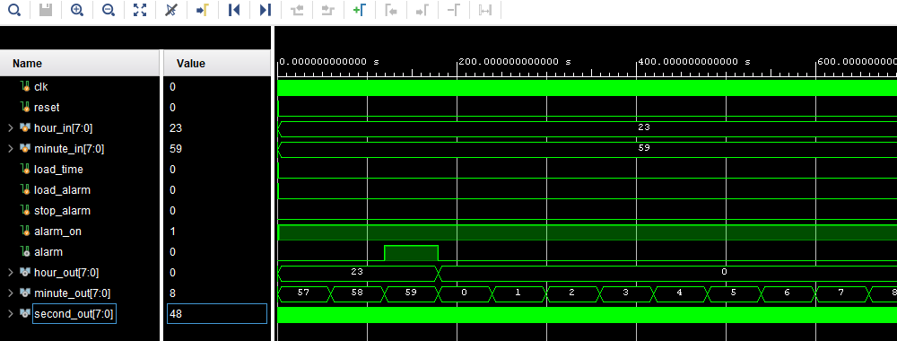

# Alarm clock
## Introduction
The simple alarm clock is shown in the following figure. The alarm clock outputs a real-time clock with a 24-hour format and also provides an alarm feature. Users also can set the clock time through switches. \
\

## Specifications
- Clock includes a reset feature to override all internal functions. The set signals, load_time and load_alarm, will allow the user to change the clock time and the alarm time respectively. In order to make these changes, the hour_in and minute_in must be have data input in 8 bits. 
- The alarm runs for a minute while the alarm time matches the clock time and will turn off automatically as soon as the clock time changes. When alarm runs the signal Alarm will be set to high, other it will be low. If alarm_on signal is set to high the alarm will runs. When user do not want to use this feature, stop_alarm will be set to high for turn off the alarm (Alarm output signal always low).
## Simulation
Simulation waveform for the alarm clock is as follows: \
 \
