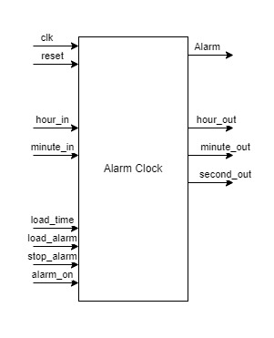

# Alarm clock
## Introduction
The simple alarm clock is shown in the following figure. The alarm clock outputs a real-time clock with a 24-hour format and also provides an alarm feature. Users also can set the clock time through switches. \
\

## Simulation
Simulation waveform for the alarm clock is as follows: \

